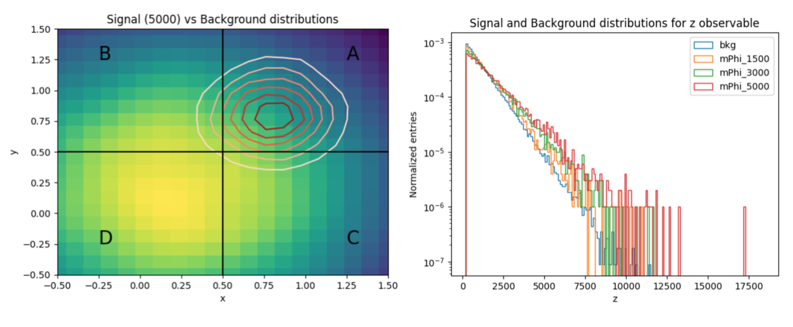

# combine_tutorial_ABCD_rooParametricHist
tutorial for Combine using RooParamertricHist to perform the ABCD method

## Introduction
The goal of this tutorial is to exemplify the usage of ```RooParametricHist``` in [CMS Combine](https://cms-analysis.github.io/HiggsAnalysis-CombinedLimit/latest/) to implement a bin-by-bin ABCD method.
In this tutorial we will work with a toy example that could resamble a real physics analysis case. We consider the search for a BSM particle $\Phi$ with a mass range between 1500 and 5000 GeV that leads some excess in the tails of an observable $z$ (which could be $p_{T,\mathrm{miss}}$ ). We assume that we have found two uncorrelated discriminating features $x$ and $y$ that can be used to build the ABCD plane (the regions A,B,C,D will be defined by cutting on $x,y$), and we assume that $z$ is uncorrelated with respect to these two features. In this way, binning the variable $z$ in the same way in the regions A,B,C,D, per-bin transfer factors in the $z$ variable can be derived with the ABCD method to obtain the estimate of the background in the signal region.

The tutorial has 4 main parts:

1. [Generate input data](#inputs)
2. [Prepare Combine datacards](#datacards)
3. [Run fit](#fit)
4. [Produce limits](#limits)

## Generate input data
<a id="inputs"></a>

The histograms for the $z$ observable in the different regions A,B,C,D can be produced using the [jupyter notebook](https://github.com/cesarecazzaniga/combine_tutorial_ABCD_rooParametricHist/blob/main/ABCD_combine_tutorial_input_histograms.ipynb). In the notebook the expected rates for different signal hypothesis (as a function of $\Phi$ mass $m_{\Phi} \in \{1500, 2000, 3000, 4000, 5000 \}$ GeV) and the background yields are specified, as well as the distributions in $x,y,z$ of the signals and backgrounds. In $x,y$, the signal and the background are assumed to be distributed as multivariate gaussians, with the background centred at $(0,2,0.2)$ in $(x,y)$ while the signals centred in the upper-right corner of the plane ($x,y>0.5$). For the $z$ feature, the background and the signal distributions are sampled from an exponential, for the signal the tails of the exponential get enhance with the mass parameter $m_{\Phi}$. 



The ABCD boundaries are chosen in the example to be $(0.5,0.5)$, and A is defined as the signal region, while the others are control regions used for the estimation of the background. From the example provided, the signal contamination in the control regions is expected to be low, and the non-closure of the background estimation to be small. The histograms for the different regions are saved in separate root files for each signal hypothesis and total background. 

## Prepare Combine datacards 
<a id="datacards"></a>

From the input histograms, for each signal hypothesis, 4 datacards can be built, one for each region of the ABCD plane. Examples of the templates for the datacards (for a signal mass point at 1500 GeV) can be found in the following. All the example datacards are stored in the directory [datacards](https://github.com/cesarecazzaniga/combine_tutorial_ABCD_rooParametricHist/tree/main/datacards). 

<details>
<summary> Datacard Region A  </summary>
```
imax * number of bins 
jmax * number of processes minus 1 
kmax * number of nuisance parameters
-----------------------------------------------------------------------------------
shapes   data_obs  A    param_ws.root    wspace:data_obs_A
shapes   Bkg  A    param_ws.root    wspace:bkg_A
shapes   mPhi1500  A    param_ws.root    wspace:mPhi1500_A
-----------------------------------------------------------------------------------
bin               A
observation       -1
-----------------------------------------------------------------------------------
bin                                     A                                            A                                          
process                                 Bkg                                          mPhi1500                                   
process                                 1                                           0                                          
rate                                    1                                           -1                                         
-----------------------------------------------------------------------------------
lumi                lnN                 -                                            1.0160000000
```

</details>

<details>
<summary> Datacard Region B  </summary>

```
imax * number of bins 
jmax * number of processes minus 1 
kmax * number of nuisance parameters
-----------------------------------------------------------------------------------
shapes   data_obs  B    param_ws.root    wspace:data_obs_B
shapes   Bkg  B    param_ws.root    wspace:bkg_B
shapes   mPhi1500  B    param_ws.root    wspace:mPhi1500_B
-----------------------------------------------------------------------------------
bin               B
observation       -1
-----------------------------------------------------------------------------------
bin                                     B                                           B                                          
process                                 Bkg                                         mPhi1500                                   
process                                 1                                           0                                          
rate                                    1                                           -1                                         
-----------------------------------------------------------------------------------
lumi                lnN                 -                                          1.0160000000

```

</details>

<details>
<summary> Datacard Region C  </summary>
  
```
imax * number of bins 
jmax * number of processes minus 1 
kmax * number of nuisance parameters
-----------------------------------------------------------------------------------
shapes   data_obs  C    param_ws.root    wspace:data_obs_C
shapes   Bkg  C    param_ws.root    wspace:bkg_C
shapes   mPhi1500  C    param_ws.root    wspace:mPhi1500_C
-----------------------------------------------------------------------------------
bin               C
observation       -1
-----------------------------------------------------------------------------------
bin                                     C                                           C                                          
process                                 Bkg                                         mPhi1500                                   
process                                 1                                           0                                          
rate                                    1                                           -1                                         
-----------------------------------------------------------------------------------
lumi                lnN                 -                                          1.0160000000

```

</details>

<details>
<summary> Datacard Region D  </summary>
  
```
imax * number of bins 
jmax * number of processes minus 1 
kmax * number of nuisance parameters
-----------------------------------------------------------------------------------
shapes   data_obs  D    param_ws.root    wspace:data_obs_D
shapes   Bkg  D    param_ws.root    wspace:bkg_D
shapes   mPhi1500  D    param_ws.root    wspace:mPhi1500_D
-----------------------------------------------------------------------------------
bin               D
observation       -1
-----------------------------------------------------------------------------------
bin                                     D                                           D                                          
process                                 Bkg                                         mPhi1500                                   
process                                 1                                           0                                          
rate                                    1                                           -1                                         
-----------------------------------------------------------------------------------
lumi                lnN                 -                                          1.0160000000

```
</details>

As an example, for each datacard, we have assigned a systematic uncertainty due to lumi to the signal processes, while no systematic on the background.


## Run Fit
<a id="fit"></a>


## Produce limits
<a id="limits"></a>

